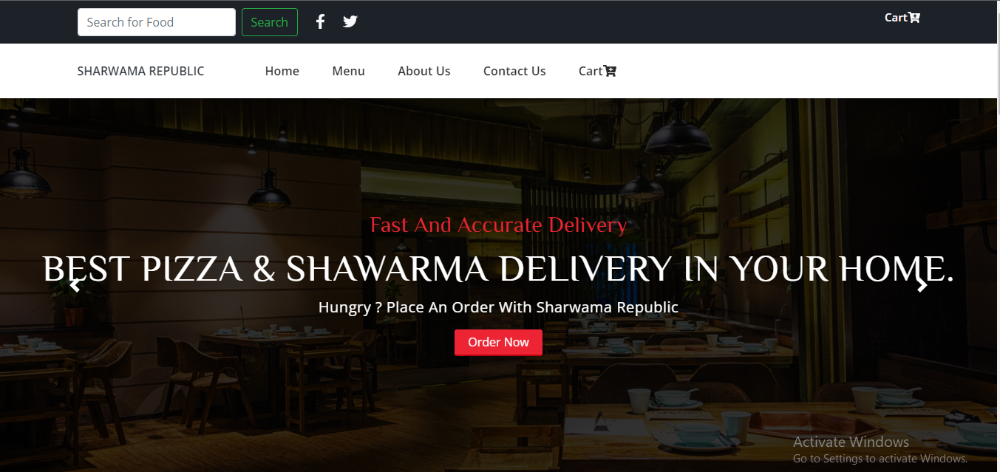
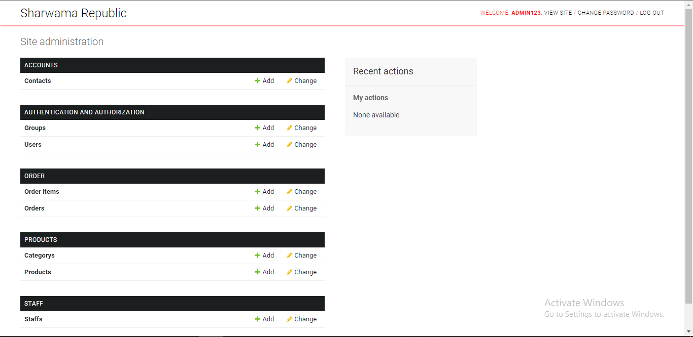

<<<<<<< HEAD

<div align="center">
# Shawarma-and-pizza-Ecommerce-Website-With-Django
The aim of this website is to enable customers order for thier favourite food online and get it delivered to them at their confort.
</div>

### Cloning the repository

--> Clone the repository using the command below :
```bash
git clone https://github.com/chiscocode/Shawarma-and-Pizza-Ecommerce-Website-With-Django.git

```

--> Move into the directory where we have the project files : 
```bash
cd Shawarma-and-pizza-Ecommerce-Website-With-Django

```

--> Create a virtual environment :
```bash
# Let's install virtualenv first
pip install virtualenv

# Then we create our virtual environment
virtualenv envname

```

--> Activate the virtual environment on windows:
```bash
envname\scripts\activate

```
or 
```source env/bin/activate``` on Mac and Linux.


--> Install the requirements :
```bash
pip install -r requirements.txt

```

Make migrations with: ```python manage.py makemigrations``` and then ```python manage.py migrate```.

#

### Running the App

--> To run the App, we use :
```bash
python manage.py runserver

```

> ⚠ Then, the development server will be started at http://127.0.0.1:8000/

#

### App Preview :

<table width="100%"> 
<tr>
<td width="50%">      
&nbsp; 
<br>
<p align="center">
  Customer Home
</p>

     


</td> 
<td width="50%">
<br>
<p align="center">
  Admin Home
</p>
     
</td>
</table>

## License
MIT License

Copyright (c) 2022 Chukwudifu Patrick Chimezie

Permission is hereby granted, free of charge, to any person obtaining a copy
of this software and associated documentation files (the "Software"), to deal
in the Software without restriction, including without limitation the rights
to use, copy, modify, merge, publish, distribute, sublicense, and/or sell
copies of the Software, and to permit persons to whom the Software is
furnished to do so, subject to the following conditions:

The above copyright notice and this permission notice shall be included in all
copies or substantial portions of the Software.

THE SOFTWARE IS PROVIDED "AS IS", WITHOUT WARRANTY OF ANY KIND, EXPRESS OR
IMPLIED, INCLUDING BUT NOT LIMITED TO THE WARRANTIES OF MERCHANTABILITY,
FITNESS FOR A PARTICULAR PURPOSE AND NONINFRINGEMENT. IN NO EVENT SHALL THE
AUTHORS OR COPYRIGHT HOLDERS BE LIABLE FOR ANY CLAIM, DAMAGES OR OTHER
LIABILITY, WHETHER IN AN ACTION OF CONTRACT, TORT OR OTHERWISE, ARISING FROM,
OUT OF OR IN CONNECTION WITH THE SOFTWARE OR THE USE OR OTHER DEALINGS IN THE
SOFTWARE


>>>>>>> 37d1a82 (modified)
